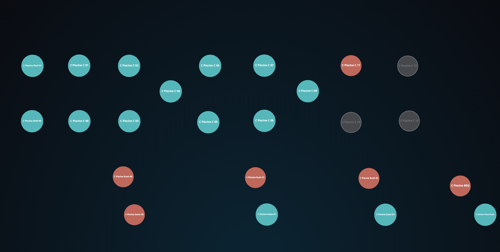
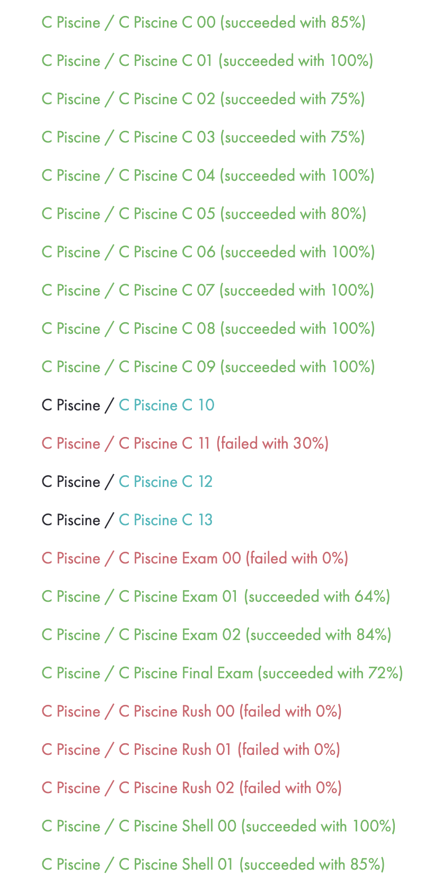

# 19piscine2020
The projects I did for the entrance exams (a.k.a "Piscine") for the s19 programming school in Brussels, member of the worldwide 42 network.

The "piscine" is an intense coding challenge where during 4 weeks the entrants need to complete as many projects as they can. It is done using Shell and C. The projects include solo projects, group projects and an exam at the end of each week which tests the acquired knowledge. It is an experience of hard work, decdication and great encounters! 

------------------------------------------------------
[**Shell**](./Shell) - the first two solo projects, aiming to teach you all you need to know about Shell and using the terminal

[**C**](./C) - the rest of the solo projects (10 projects out of 13 done here), immerse you in the C language 

[**Rush**](./Rush) - the group projects, done during weekends and also coded in C language

------------------------------------------------------

*Please note that if you are a student attempting to enter the school, using github and other people's code is considered cheating, so avoid using my code in your projects for your own sake.*

#### My Results:

------------------------------------------------------

